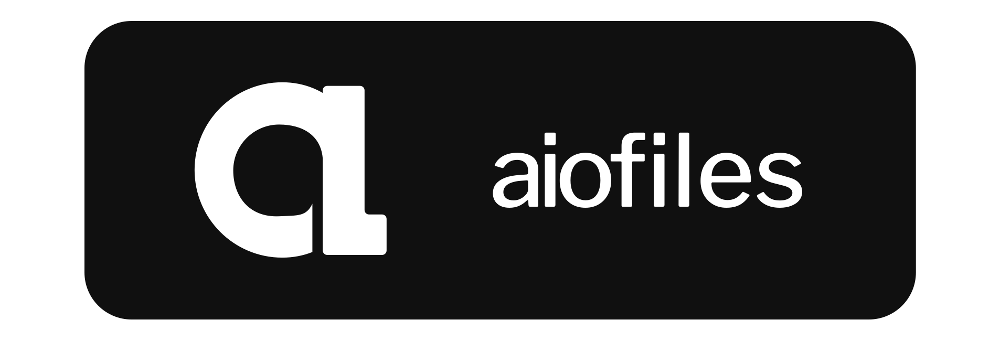
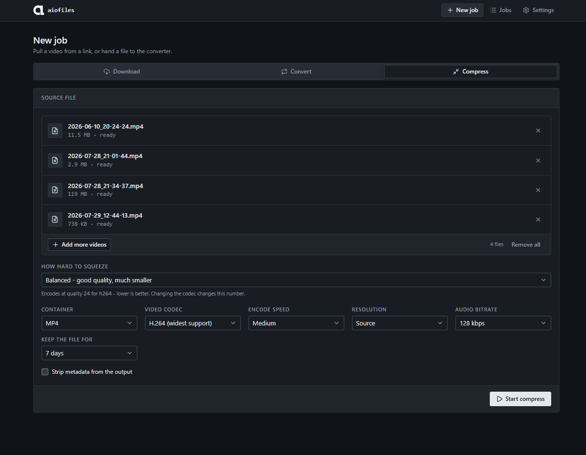
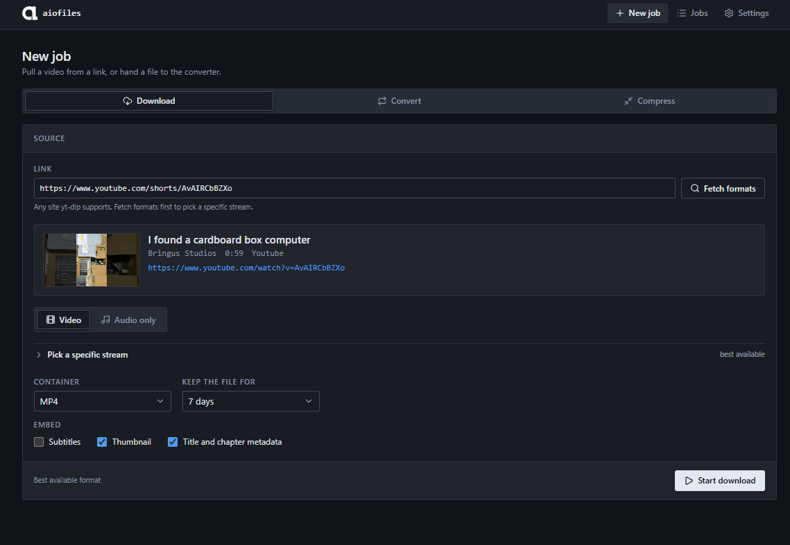

<p align="center"><br>
<a href="docs/configuration.md">Configuration</a> - <a href="docs/api.md">API</a> - <a href="docs/troubleshooting.md">Troubleshooting</a> - <a href="LICENSE">License</a><br><br>AIOFiles is a self-hosted media toolkit for downloading videos, converting and compressing files, and processing images.<br> It runs as a web app backed by background workers, stores its data on disk, and exposes the same functionality through an HTTP API.</p>

<p align="center"></p>

## Quick Start

The fastest way to run AIOFiles is with Docker Compose:

1. Copy [.env.example](.env.example) to `.env`.
2. Get  [docker-compose.yml](docker-compose.yml)
3. Set `PUID` and `PGID` to match your host user if you want the files in `./data` to be owned by you.
4. Set `AUTH_USERNAME` and either `AUTH_PASSWORD_HASH` or `AUTH_PASSWORD` if you want login enabled.
5. Start the stack with `docker compose up -d`.
6. Open `http://localhost:1144`.

To generate a password hash:

```sh
docker compose run --rm --entrypoint aiofiles aiofiles -hash-password 'your password'
```

## What It Does

- Downloads media with `yt-dlp`.
- Converts and compresses files with `ffmpeg`.
- Processes images with ImageMagick.
- Queues work, tracks progress, and streams updates over SSE.
- Persists jobs, uploads, and sessions in SQLite.

Everything is driven by environment variables. The defaults and the rules that are easy to miss are documented here:

- [Configuration](docs/configuration.md)
- [.env.example](.env.example)
- [docker-compose.yml](docker-compose.yml)

## Information
- The app stores persistent data under `./data` by default.
- Authentication is optional, but when it is enabled you need both a username and a password hash.
- Large uploads, retention, and worker concurrency are all controlled through environment variables rather than a settings screen.

<p align="center"><picture><source media="(prefers-color-scheme: dark)" srcset="https://www.shieldcn.dev/github/stars/panonim/aiofiles.svg?variant=secondary&amp;size=lg&amp;mode=dark&amp;theme=neutral&amp;font=space-grotesk"></picture>
&nbsp;
<picture><source media="(prefers-color-scheme: dark)" srcset="https://www.shieldcn.dev/github/release/panonim/aiofiles.svg?size=lg&amp;mode=dark&amp;theme=neutral&amp;font=space-grotesk"></picture>
&nbsp;
<picture><source media="(prefers-color-scheme: dark)" srcset="https://www.shieldcn.dev/github/contributors/panonim/aiofiles.svg?theme=emerald&amp;size=lg&amp;mode=dark&amp;font=space-grotesk"></picture>
&nbsp;
<picture><source media="(prefers-color-scheme: dark)" srcset="https://www.shieldcn.dev/github/last-commit/panonim/aiofiles.svg?variant=secondary&amp;size=lg&amp;mode=dark&amp;theme=neutral&amp;font=space-grotesk"></picture>
&nbsp;
<picture><source media="(prefers-color-scheme: dark)" srcset="https://www.shieldcn.dev/github/open-issues/panonim/aiofiles.svg?variant=secondary&amp;size=lg&amp;mode=dark&amp;theme=neutral&amp;font=space-grotesk"></picture>
&nbsp;
<a href="https://ko-fi.com/panonim"><picture><source media="(prefers-color-scheme: dark)" srcset="https://shieldcn.dev/badge/Sponsor.svg?variant=secondary&amp;size=lg&amp;theme=neutral&amp;font=fira-code&amp;logo=ri%3ABsHeartFill&amp;mode=dark"></picture></a></p>